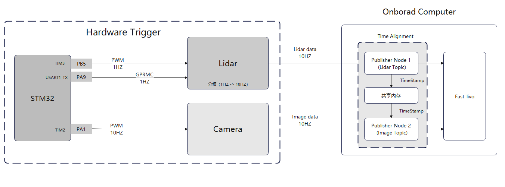
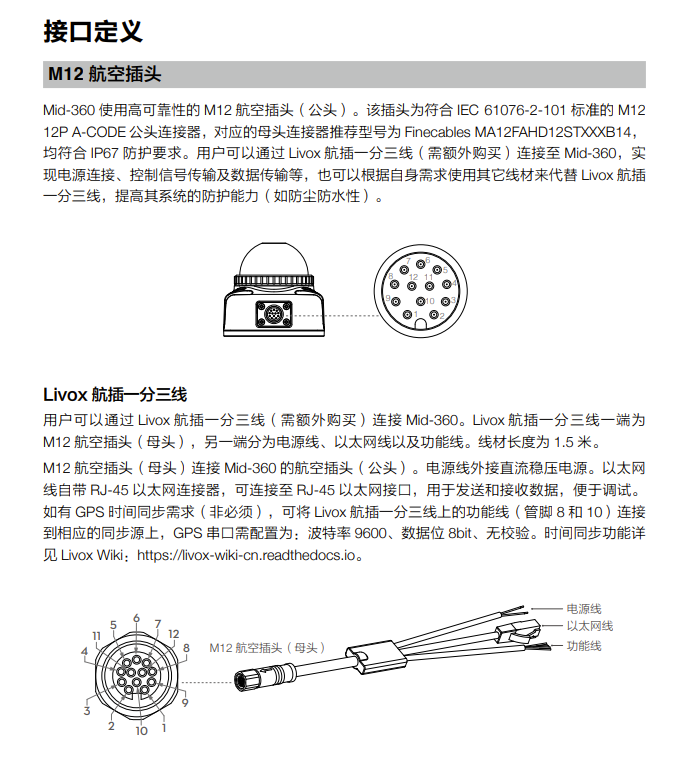
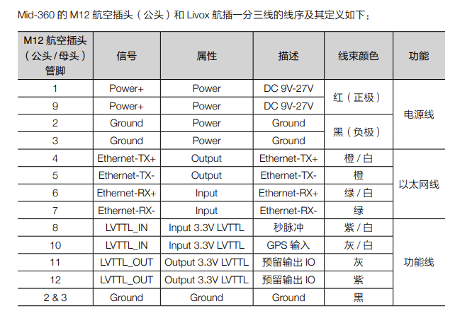
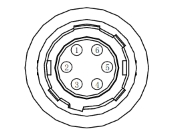
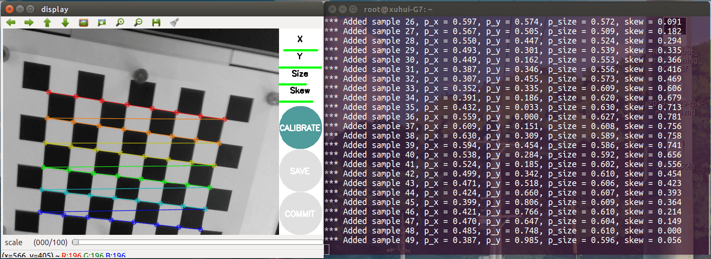

# FAST-LIVO2 handhold复现指南
本项目基于[`liv-handhold2 (LIV-Eye)`](https://github.com/hku-mars/LIV_handhold_2)、 [`liv-handhold`](https://github.com/xuankuzcr/LIV_handhold)的硬件，运行[`FAST-LIVO2`](https://github.com/hku-mars/FAST-LIVO2)。
- wiki可参考: [简达智能的wiki](https://gitee.com/gwmunan/ros2/wikis)
- 参考视频：[GundaSmart: SLAM系列之Fast Livo复现](https://www.bilibili.com/video/BV1T142197ci)

## 项目相关仓库readme导航

> ### 驱动
> - [HIKROBOT-MVS-CAM](src/HIKROBOT-MVS-CAMERA-ROS/README.md)
>> - 海康威视工业相机SDK的ros驱动依赖MVS的库文件。因此请先安装[MVS客户端](https://www.hikrobotics.com/cn/machinevision/service/download/?module=0)，根据自己的平台架构下载安装，或使用`additional_software`中预先下载的版本。
> - [livox_ros_driver2](src/livox_ros_driver2/README.md)
> - [Livox-SDK2](src/Livox-SDK2/README.md)

> ### 标定与启动
> - [FAST-Calib readme](src/FAST-Calib/README.md)
> - [FAST-Calib workflow](src/FAST-Calib/workflow.md)
> - [FAST-LIVO2 readme](src/FAST-LIVO2/README.md)

## catkin工作空间初始化
从github clone本仓库后，需要cd到工作空间根目录，执行`catkin init`完成工作空间初始化。

## 编译
如果需要编译，在src所在的目录执行 `catkin_make` 即可，必要时删除`build` 和 `devel`目录。

## 硬件与配件
### 外壳结构
* 本项目使用的是基于GitHub [`liv-handhold2 (LIV-Eye)`](https://github.com/hku-mars/LIV_handhold_2)仓库提供文件修改的3D打印件，3D打印模型位于`CAD_models`。

### 硬件选型
* 硬件部分使用MID-360以及海康工业相机MV-CS020-10UC。
* 项目运行在Nvidia Jetson Orin NX（aarch64架构），所以一些驱动（如MVS）与FAST-LIVO2原项目使用的驱动不一致。

### Livox Viewer 2
唯一与MID-360兼容的官方工具。连接LiDAR要设置本机LAN IP为192.168.1.50，应用里面可以设置硬件级噪点滤除等功能。

如果遇到PIN10 串口GPRMC消息输入没反应的话，试试用Livox Viewer 2升级MID-360固件。

### 硬件同步与同步器连接（可选）
* ***FAST-LIVO2不强制要求使用硬件同步*** ，但使用硬件同步的效果更好，可将数据周期采样时间差控制在2ms以内。如果使用软同步，修改`src/FAST-LIVO2/config/mid360.yaml`的`img_time_offset`（时间偏移）参数，约0.1，按实际情况调整。
* 本项目对应使用的是GitHub [`liv-handhold`](https://github.com/xuankuzcr/LIV_handhold)仓库中使用的自制STM32硬件同步器。
* 本项目参考 [`liv-handhold`](https://github.com/xuankuzcr/LIV_handhold)仓库中对`livox_ros_driver2`的更改，修复了STM32硬件同步器由于使用固定初始值的虚拟时间，导致MID-360与工业相机Header Time差异过大，无法运行FAST-LIVO2的问题。
* 关于引脚图，工业相机的引脚可直接使用仓库对应的引脚，MID-360使用`MID360-pin8`对应`STM32-PB5`、`MID360-pin10`对应`STM32-PA9`。  
* 注意线材焊接的可靠性，虚焊会导致波形失真、串口通信异常，导致硬件同步失效。

#### 硬件接口与引脚连接指南
<center>

   
硬件连线示意图


  
MID360引脚图

<table>
  <tr>
    <th>MVS Camera 6PIN</th>
    <th>Name</th>
    <th>I/O Type</th>
    <th>Description</th>
    <th>Peripheral Function</th>
    <th>Diagram</th>
  </tr>
  <tr>
    <td>PIN 1</td>
    <td>DC_PWR</td>
    <td>--</td>
    <td>Power Supply</td>
    <td></td>
    <td rowspan="8" style="text-align: center;">
      <br>
      <span style="display: block; text-align: center;">MVS Camera 6-Pin Interface</span>
    </td>
  </tr>
  <tr>
    <td>PIN 2</td>
    <td>OPTO_IN</td>
    <td>Line 0+</td>
    <td>Optical Isolation Input</td>
    <td>STM32 PA1</td>
  </tr>
  <tr>
    <td>PIN 3</td>
    <td>GPIO</td>
    <td>Line 2+</td>
    <td>General Purpose Input/Output</td>
    <td></td>
  </tr>
  <tr>
    <td>PIN 4</td>
    <td>OPTO_OUT</td>
    <td>Line 1+</td>
    <td>Optical Isolation Output</td>
    <td></td>
  </tr>
  <tr>
    <td>PIN 5</td>
    <td>OPTO_GND</td>
    <td>Line 0- / 1-</td>
    <td>Optical Isolation Ground</td>
    <td>STM32 GND</td>
  </tr>
  <tr>
    <td>PIN 6</td>
    <td>GND</td>
    <td>Line 2-</td>
    <td>Ground</td>
    <td></td>
  </tr>
</table>
<hr>
海康工业相机引脚图
<hr>

<table>
  <tr>
    <th>STM32</th>
    <th>Peripheral Function</th>
  </tr>
  <tr>
    <td>PA1</td>
    <td>MVS camera PIN2 (PPS)</td>
  </tr>
  <tr>
    <td>PB5</td>
    <td>MID-360 PIN8（PPS）</td>
  </tr>
  <tr>
    <td>PA9</td>
    <td>MID-360 PIN10（串口输出）</td>
  </tr>
  <tr>
    <td>VCC</td>
    <td>所有设备共用VCC</td>
  </tr>
  <tr>
    <td>GND</td>
    <td>所有设备共用GND | MVS camera PIN5 (GND)</td>
  </tr>
</table>

</center>

---
#### 关于海康工业相机的硬件同步
`HIKROBOT-MVS-CAMERA-ROS` 仓库本身代码没有写硬件同步功能，但代码中有可修改的相关函数  
修改软硬件同步模式需要修改 `src/HIKROBOT-MVS-CAMERA-ROS/include/hikrobot_camera.hpp` 207行附近，并重新编译：
``` hpp
        //软件触发0，硬件触发1
        // TODO： 按需修改
        // ********** frame **********/
        nRet = MV_CC_SetEnumValue(handle, "TriggerMode", 1);    // 这里修改0/1
``` 
配套使用  
`src/HIKROBOT-MVS-CAMERA-ROS/launch/hikrobot_camera_rviz_trigger.launch`   
`src/HIKROBOT-MVS-CAMERA-ROS/config/camera-trigger.yaml`  
这里外部硬件触发使用的是线路0，上升沿触发。

如果是软触发，使用  
`src/HIKROBOT-MVS-CAMERA-ROS/launch/hikrobot_camera_rviz.launch`   
`src/HIKROBOT-MVS-CAMERA-ROS/config/camera.yaml`

---
#### MID-360的硬件同步
* STM32 PA9输出模拟的GPRMC消息，示例：
  > $GPRMC,000010.00,A,2237.496474,N,11356.089515,E,0.0,225.5,230520,2.3,W,A\*29  
  > $GPRMC,HHMMSS.00,状态,纬度,北纬/南纬,经度,东经/西经,速度,航向,DDMMYY,磁偏角,模式\*校验和
* STM32 PA9串口输出的参数：
  > 波特率: 9600  
  > 校验位: None  
  > 数据位: 8  
  > 停止位（如有）: 1  

MID-360的硬件同步原理见[livox_wiki](https://github.com/Livox-SDK/livox_wiki_cn/blob/master/source/tutorials/new_product/common/time_sync.rst)

看ROS消息的header time，如果实际time与理论time的误差在1ms以内，则可判定硬件同步有起作用。

## LIVOX MID-360与海康MV-CS020-10UC一同启动
在 `src/FAST-Calib/launch_sensors/rviz_MID360_HIK.launch` 中配置了MID360和HIK-MV-CS020-10UC（对应软触发，检查`HIKROBOT-MVS-CAMERA-ROS` 仓库`hikrobot_camera.hpp` 代码并编译）  

执行 `roslaunch rviz_MID360_HIK.launch` 即可启动，（带rviz），如果不需要rviz，在launch文件里面把rviz disable即可。

相关rviz配置文件在 `src/FAST-Calib/rviz_cfg/MID360_HIKCS020.rviz` 

## 标定

### 相机标定（张氏标定法）
- 建议使用80mm棋盘格，适合远距离标定。
- 建议7*10

具体步骤：
1. 安装标定功能包  
``` bash
sudo apt install ros-$ROS_DISTRO-camera-calibration
```
2. 制作标定板: [棋盘格标定板生成器](https://calib.io/zh/pages/camera-calibration-pattern-generator)
3. 打开相机节点
``` bash
roslaunch src/HIKROBOT-MVS-CAMERA-ROS/launch/hikrobot_camera_rviz_trigger.launch
```
4. 打开标定节点
``` bash
rosrun camera_calibration cameracalibrator.py --size 7x4 --square 0.08 image:=/left_camera/image(这里要换成hik相机的topic)
```
5. 移动摄像头让4个条变绿

6. 点击标定按钮计算内参


### LiDAR-CAM联合标定

#### rosbag文件录制
要先启动相应传感器的topic发布（见上节），再录制。   

`src/FAST-Calib/calib_data/record_MID360_HIK.sh` 是录制脚本，具体cat一下就知道

输出文件名格式为 20260401_2156.bag

#### 联合标定
录制完成rosbag之后，分别新建三个终端窗口，依次执行：
``` bash
roscore

rosbag play -l 20260401_2156.bag

rqt_image_view
```
保存录制好的bag中的image到`src/FAST-Calib/calib_data/`，与bag文件放在一起。

修改`src/FAST-Calib/config/qr_params.yaml` 中的参数，设置相机内参、标定板参数、以及点云约束范围、bag路径等。  
其中点云约束范围可以通过`src/FAST-Calib/scripts/distance_filter_tool.py` 得到。   
用法示例：
``` bash
python3 distance_filter_tool.py
#或
python3 distance_filter_tool.py /path/to/data.bag /path/to/output_dir
python3 distance_filter_tool.py ../calib_data/20260401_2156.bag ../output/scripts/
```
按console提示选取平面上四个点，按Q即可选取范围，填到yaml文件里面即可。

``` bash
python distance_filter_tool.py ../calib_data/20260401_2156.bag ../output/scripts/
```

设置好yaml以后，运行标定：
``` bash
roslaunch fast-calib calib.launch
```

## fastlivo2配置
得到相机-LiDAR标定结果后，填入`src/FAST-LIVO2/config/mid360.yaml`。  
相机内参填入`src/FAST-LIVO2/config/camera_pinhole_MV-CS020.yaml`  

如果更换传感器型号，可以新建yaml文件，并修改launch文件。  
launch文件这里对应`src/FAST-LIVO2/launch/mapping_mid360.launch`。

修改完配置，回到src同级目录，重新编译。


## fastlivo2启动
先启动雷达

再启动相机（记得改成trigger模式）

这里写了一个集成启动的launch脚本，文件位置： `src/FAST-Calib/launch_sensors/rviz_MID360_HIK.launch`

最后启动fastlivo2主节点
``` bash
roslaunch src/FAST-LIVO2/launch/mapping_mid360.launch
```

## 如果要在docker容器中配置
* 创建好容器环境
  ```bash
  docker run -it \
  -e DISPLAY=$DISPLAY \
  -v /tmp/.X11-unix:/tmp/.X11-unix \
  --net=host \
  -v /home/orin09/FAST-LIVO2-HandHold:/root/FAST-LIVO2-HandHold \
  -w /root/FAST-LIVO2-HandHold \
  --name=fast-livo2 \
  nvcr.io/nvidia/l4t-jetpack:r35.3.1
  ```
* 安装ros noetic
  ```bash
  wget http://fishros.com/install -O fishros && . fishros
  ```
* 编译安装Sophus
  ```bash
  cd src/Sophus
  mkdir build && cd build && cmake ..
  make
  sudo make install
  ```
* 安装海康工业相机驱动依赖
  ```bash
  cd additional_software/
  dpkg -i ./MVS-3.0.1_aarch64_20251113.deb
  dpkg -i ./MvCamCtrlSDK_Runtime-4.7.0_aarch64_20251113.deb
  ```
* 编译catkin
  ```bash
  cd ..
  catkin_make
  ```
* ***待完善***

## 踩坑记录
### FAST-Calib 编译遇到opencv2/aruco.hpp问题
这是因为 ArUco 模块在 OpenCV 3.x/4.x 中被分离到了 opencv_contrib 中，需要单独安装。

#### 无损补全原厂 OpenCV 的 contrib 模块（保留 CUDA 加速）
由于l4t镜像自带的opencv是4.5.4，为避免破坏系统环境依赖，保证cuda加速等功能可用，我们可以编译和原厂版本、安装路径、CUDA 配置完全一致的 OpenCV 4.5.4 + opencv_contrib，覆盖安装。

操作步骤
1. 安装编译依赖（不卸载任何现有包）
    ``` bash
    sudo apt update
    sudo apt install -y build-essential cmake git pkg-config libgtk-3-dev \
    libavcodec-dev libavformat-dev libswscale-dev libv4l-dev \
    libxvidcore-dev libx264-dev libjpeg-dev libpng-dev libtiff-dev \
    gfortran openexr libatlas-base-dev python3-dev python3-numpy \
    libtbb2 libtbb-dev libeigen3-dev libgstreamer1.0-dev \
    libgstreamer-plugins-base1.0-dev
    ```
2. 下载和系统版本完全匹配的源码
    ``` bash
    cd ~
    # 必须和你当前的OpenCV版本完全一致：4.5.4
    git clone --depth 1 --branch 4.5.4 https://github.com/opencv/opencv.git
    git clone --depth 1 --branch 4.5.4 https://github.com/opencv/opencv_contrib.git
    ```
3. CMake 配置（完全匹配 Jetson 原厂参数）
    ``` bash
    cd opencv
    mkdir build && cd build
    
    # 核心参数说明：
    # CMAKE_INSTALL_PREFIX=/usr：和原厂安装路径完全一致，保证原有组件正常链接
    # CUDA_ARCH_BIN=8.7：Orin NX专属算力架构，必须正确设置才能保留CUDA加速
    cmake -D CMAKE_BUILD_TYPE=RELEASE \
    -D CMAKE_INSTALL_PREFIX=/usr \
    -D OPENCV_EXTRA_MODULES_PATH=~/opencv_contrib/modules \
    -D WITH_CUDA=ON \
    -D CUDA_ARCH_BIN=8.7 \
    -D CUDA_ARCH_PTX=8.7 \
    -D WITH_CUDNN=ON \
    -D OPENCV_DNN_CUDA=ON \
    -D ENABLE_FAST_MATH=1 \
    -D CUDA_FAST_MATH=1 \
    -D WITH_CUBLAS=1 \
    -D WITH_LIBV4L=ON \
    -D WITH_GSTREAMER=ON \
    -D BUILD_opencv_python3=ON \
    -D BUILD_EXAMPLES=OFF \
    -D BUILD_DOCS=OFF \
    -D BUILD_PERF_TESTS=OFF \
    -D BUILD_TESTS=OFF \
    -D OPENCV_ENABLE_NONFREE=ON \
    ..
    ```
4. 编译并覆盖安装
    ``` bash
    # Orin NX是8核CPU，用-j8加速编译，全程约30分钟
    make -j8
    # 覆盖安装到系统路径，补全contrib模块
    sudo make install
    # 更新系统动态链接库缓存
    sudo ldconfig
    ```
5. 验证安装
    ``` bash
    # 确认版本仍为4.5.4
    pkg-config --modversion opencv4
    # 确认ArUco头文件已存在
    ls /usr/include/opencv4/opencv2/ | grep aruco.hpp
    ```

### libusb编译连接错误
> /usr/bin/ld: /usr/lib/gcc/aarch64-linux-gnu/9/../../../aarch64-linux-gnu/libpcl_io.so: undefined reference to `libusb_set_option'
> collect2: error: ld returned 1 exit status

解决方案
在相关报错包的CMakeLists.txt中的find_library、target_link_libraries部分添加libusb依赖：
``` cmake
...
find_library(LIBUSB_1_LIBRARY usb-1.0 REQUIRED)

...

target_link_libraries(fast_calib
  ...
  ${LIBUSB_1_LIBRARY}
)
...
```

### HIKROBOT-MVS-CAMERA-ROS包编译报错
改CMakeLists.txt：
* opencv版本
* target_link_libraries里面若有报错，去`/opt/MVS/lib/aarch64/`里面找，找到的就改成对应的版本，找不到直接注释掉。

### 启动fastlivo2什么也看不到  
* Case1
一定记得把launch文件里面的livox点云数据结构改为自定义格式！！！  
否则启动fastlivo2什么也看不到     
文件位置 `src/FAST-Calib/launch_sensors/rviz_MID360_HIK.launch`
```
<arg name="xfer_format" default="1"/>
```

* Case2
注意LiDAR和相机消息的时间戳，相差太大会自动丢弃，导致没有输出。


### 贴图不准（尤其是物体边缘）
这时要调整`src/FAST-LIVO2/config/mid360.yaml`的img_time_offset

先用rosbag record命令录制lidar和相机的数据（10s左右即可），然后使用`rqt_bag`工具：
``` bash
rqt_bag src/FAST-Calib/calib_data/20260402_1835.bag 
```
这里可以看到时间轴，计算数据之间的平均差写入yaml文件，效果会有所改善。

## 待解决
- 使用硬件同步器时，由于GPRMC消息附带时间时固定的，导致与相机的time stamp 差距过大，无法正常运行算法。 因此使用xuankuzcr的方法，将相机时间戳与LiDAR时间戳拉齐，但可能会导致软同步模式有轻微ms级误差。

